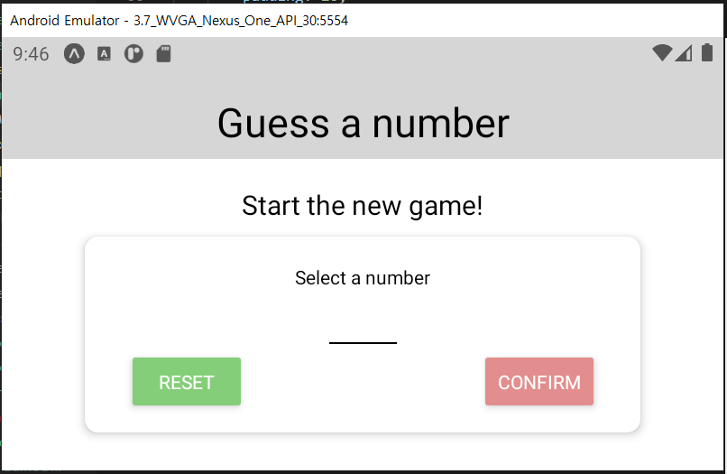
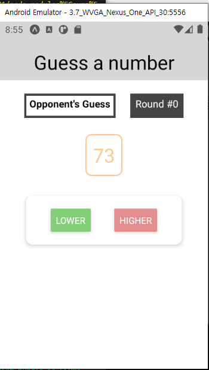
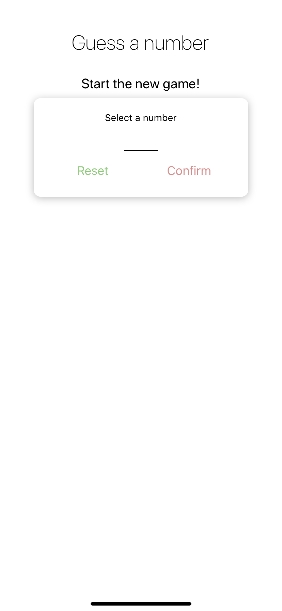

# guess-num-game app

## 1. envrionmental settings

Used react-native by expo version 3.21.3.
I followed the tutorials of academind course "React Native - The Practical Guide 2020", and this repository is about building the guess-num-game.

## 2. What I learned from this course

> Starting by the Responsive & Adaptive User Interfaces and Apps part.

### (1) styles

#### maxWidth, minWidth, width

```js
inputContainer: {
        width: "80%",
        alignItems: "center",
        maxWidth: "95%",
        minWidth: 300,
}
```

이때 default는 80%이되,
화면이 엄청 작아지면 minWidth를 300으로 설정하여 inputContainer 안의 아이템들의 질서가 깨지지 않게 한다.
또한 maxWidth를 95%로 설정하여 inputContainer의 width 자체가 화면을 벗어나지 않게 한다.

### (2) 가로 방향 화면일 때

#### Dimensions

```js
import { Dimensions } from "react-native";

const styles = StyleSheet.create({
    button: {
        // width: 100,
        width: Dimensions.get("window").width / 4,
    },
});
```

여기서 button을 width: 100으로 해놨다면 다양한 화면들에 대해서 깨질 가능성도 있다. 따라서 Dimensions api를 import하여 Dimensions를 받아와 width를 받아서 크기를 조절하면 수월할 수 있다.

또한, Dimensions api를 통해 받은 화면의 크기로 전달해줄 styesheet object를 if문으로 선택하는 것도 가능하다(아래 코드 참고).

```js
import React from "react";
import { View, Text, StyleSheet, Dimensions } from "react-native";

const GameScreen = (props) => {
    let deScreen = styles.screen;
    // 아래가 중요한 코드: if문으로 스크린의 너비에 맞게 styles component를 쓰게 함.
    if (Dimensions.get("window").width > 600) {
        deScreen = styles.bigScreen;
    }
    return (
        <View styles={deScreen}>
            <Text>...</Text>
        </View>
    );
};

const styles = StyleSheet.create({
    screen: {
        flex: 1,
        padding: 10,
        alignItems: "center",
    },
    bigScreen: {
        flex: 1,
        padding: 20,
        alignItems: "center",
    },
});
```

#### components ScrollView, KeyboardAvoidingView, TouchableWithoutFeedback

/app.json에서 `"orientation": "default",`로 만들어주면 디바이스의 방향이 가로방향일 때도 가로화면으로 뜬다.



그런데 아래에 있는 버튼을 조작할 수가 없다. 이를 위해 ScrollView로 감쌀 수 있고, 키패드 때문에 입력하는 칸이 가려지는 걸 방지하기 위해 KeyboardAvoidingView를 이용할 수 있다.

```js
const StartGameScreen = (props) => {
    return (
        <ScrollView>
            // 가로 방향 화면일 때 스크롤 가능하게 해서 컨펌하는 버튼에 접근 가능하게 하기
            <KeyboardAvoidingView behavior="position" keyboardVerticalOffset={30}>
                // 입력할 때=즉 키패드가 올라올 때 화면이 같이 밀려 올라가는 효과. position은 ios에 좋고, padding은 android에 좋다고 함.
                <TouchableWithoutFeedback
                    onPress={() => {
                        Keyboard.dismiss();
                    }}
                >
                    // 다른 화면을 눌러서 키패드를 dismiss하게 함<View style={styles.screen}>// 편의상 생략</View>
                </TouchableWithoutFeedback>
            </KeyboardAvoidingView>
        </ScrollView>
    );
};
```

#### 버튼 크기 화면에 맞추기

화면 방향이 가로->세로->가로 이렇게 바뀔 때마다 Dimensions.get으로 받아오는 게 아니므로 바뀔 때마다 받아 와야 한다.
그래서 useEffect와 useState를 이용하여 remount를 할 때마다 화면의 상태를 받아온다.(추측)

```js

const StartGameScreen = (props) => {
    const [buttonWidth, setButtonWidth] = useState(Dimensions.get("window").width / 4);

    useEffect(() => {
        const updateListener = () => {
            setButtonWidth((buttonWidth) => Dimensions.get("window").width / 4);
        };
        Dimensions.addEventListener("change", updateListener);
        return () => {
            Dimensions.removeEventListener("change", updateListener);
        };

    return (
        <ScrollView>
            <View style={{ width: buttonWidth }}>
                {/* 여기서 onPress={()=> {resetInputHandler}} 이거 이렇게 쓰면 안됨.  */}
                <Button title="Reset" onPress={resetInputHandler} color={Colors.green__darker} />
            </View>
            <View style={{ width: buttonWidth }}>
                <Button title="Confirm" onPress={confirmInputHandler} color={Colors.primary__darker} />
            </View>
        </ScrollView>
    );
    });
```

1. useState 정확하게 알기
2. useEffect 정확하게 알기: return문으로 함수 reference를 넘기면 어떻게 되는 지..?

#### ScreenOrientation 특정 화면에만 구현하기

ScreenOrientation을 화면에 대해 잠궈 보자.
즉, 화면을 기울어도(가로 방향 모드) app 내의 화면은 잠긴 상태인 것이다.

```js
// GameScreen.js
import { ScreenOrientation } from "expo";
const GameScreen = (props) => {
    ScreenOrientation.lockAsync(ScreenOrientation.OrientationLock.PORTRAIT);
};
```

위 코드가 동작을 하지 않아 따로 cmd에 expo-screen-installation을 install하고 import를 그에 맞춰했다.

```bash
// 프로젝트 root directory에서
expo install expo-screen-installation
```

```js
// GameScreen.js
import * as ScreenOrientation from "expo-screen-orientation";

const GameScreen = (props) => {
    // GameScreen에 진입했을 때는 화면 방향을 바꿔도 화면은 그대로로.
    ScreenOrientation.lockAsync(ScreenOrientation.OrientationLock.PORTRAIT);
    return <View>생략</View>;
};
```

#### Platform api

1. Platform.OS

```js
// Header.js
// 중요한 것 외엔 생략
import { View, StyleSheet, Platform } from "react-native";

const Header = (props) => {
    return <View style={styles.header}></View>;
};
const styles = StyleSheet.create({
    header: {
        // Platform OS 이용하기, "android"외 "ios"도 있음.
        backgroundColor: Platform.OS === "android" ? "#d6d6d6" : "white",
    },
});

export default Header;
```

그래서 결과는

|                             android                             |                               ios                               |
| :-------------------------------------------------------------: | :-------------------------------------------------------------: |
|  |  |

이렇게 나온다.

이를 심화해서 Platform.select 메소드를 사용하면 아래와 같이 사용하여 platform os마다 Styles를 다르게 줄 수도 있다.

```js
import { View, Text, StyleSheet, Platform } from "react-native";

const Header = (props) => {
    return (
        <View
            style={{
                ...styles.headerBase,
                // 아래 코드에 집중
                ...Platform.select({
                    ios: styles.headerIOS,
                    android: styles.headerAndroid,
                }),
            }}
        ></View>
    );
};
const styles = StyleSheet.create({
    headerBase: {},
    headerIOS: {},
    headerAndroid: {},
});
```

또한, 이는 MainButton.js지만(현재 이 repository에는 해당 내용 존재하지 않음) 이렇게 쓸 수 있다는 것만 참고하자.

```js
const MainButton = (props) => {
    let ButtonComponent = TouchableOpacity;
    if (Platform.OS === "android" && Platform.version >= 21) {
        ButtonComponent = TouchableNativeFeedback;
    }
    return (
        // 필요한 것 제외하고는 생략하기
        <View>
            <ButtonComponent></ButtonComponent>
        </View>
    );
};
```

Android, IOS에 따라 다른 js code 적용되게 하려면,
MainButton.js 파일에서  
=> MainButton.android.js  
=> MainButton.ios.js  
이렇게 두개의 파일을 생성한다.

그런데 android인 지 ios인지 체크할 필요는 없으므로, Platform.OS 와 관련된 코드는 삭제해도 무방하다.
또한, MainButton을 참조하는 js 파일에서 import문을 작성할 때 MainButton.android나 MainButton.ios 로 부르지 않고, MainButton으로 부른다.

#### SafeAreaView 컴포넌트

ios의 특이한 화면구성을 생각했을 때(전면 카메라가 화면쪽으로 돌출되어있는 디자인), 이를 고려한 "SafeAreaView"가 필요하다. 이는 화면의 물리적 한계를 보완하고자 하는 컴포넌트라고 한다.

그래서 App.js에서 모든 화면을 감싸는 형태로 render해 주면 ios의 화면구성을 더 수월하게 할 수 있다.

```js
import { StyleSheet, Text, View, SafeAreaView } from "react-native";

export default function App() {
    return (
        <SafeAreaView style={styles.screen}>
            <Header title="Guess a number"></Header>
            {content}
        </SafeAreaView>
    );
}
```
